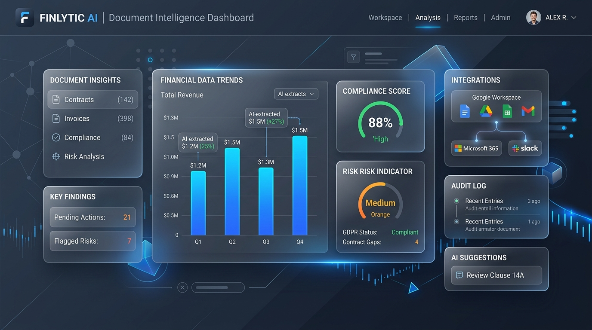
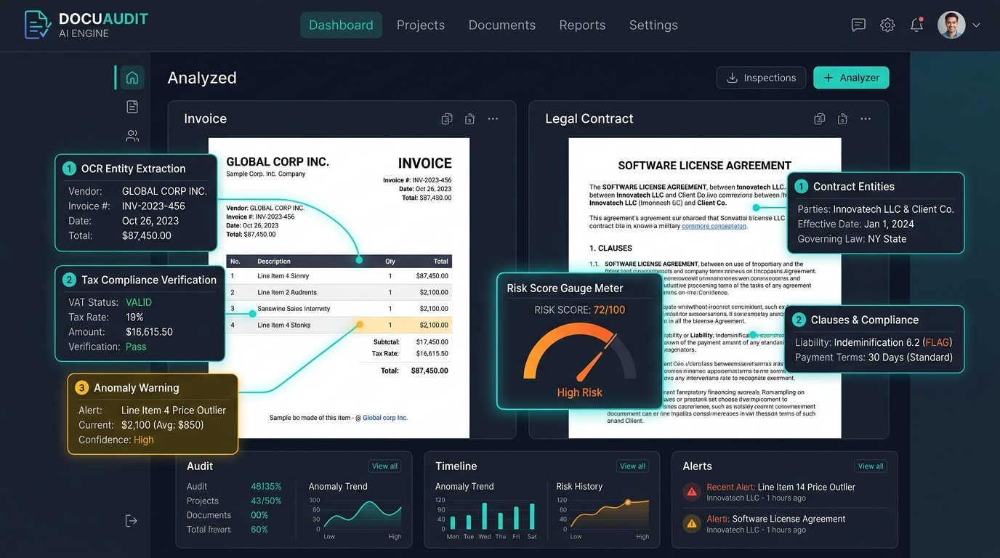
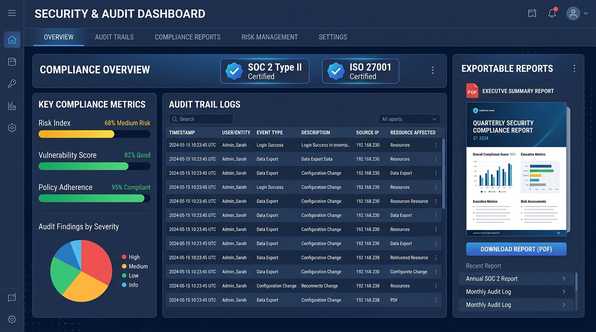

# 🏢 B2B SaaS & Document Intelligence Platform
### এন্টারপ্রাইজ ডকুমেন্ট ইন্টেলিজেন্স, গুগল ড্রাইভ এআই ওয়ার্কফ্লো ও ক্লাউড কমপ্লায়েন্স অডিট ট্রেইল

[](https://www.typescriptlang.org/)
[](https://reactjs.org/)
[](https://tailwindcss.com/)
[](https://firebase.google.com/)
[](https://ai.google.dev/)
[](#)

---

<div align="center">
  
  <p><em>চিত্র ১: এন্টারপ্রাইজ B2B SaaS ডকুমেন্ট ইন্টেলিজেন্স ও কমপ্লায়েন্স প্ল্যাটফর্ম আর্কিটেকচার ড্যাশবোর্ড</em></p>
</div>

---

## 📌 সারসংক্ষেপ (Overview)

**B2B SaaS & Document Intelligence Platform** হলো একটি অত্যাধুনিক এন্টারপ্রাইজ ক্লাউড অ্যাপ্লিকেশন, যা বড় প্রতিষ্ঠানগুলোর ইনভয়েস, চুক্তিপত্র, ক্লাউড বিল, ব্যাংক স্টেটমেন্ট এবং স্পেসিফিকেশন ডকুমেন্ট স্বয়ংক্রিয়ভাবে অডিট, অ্যানালাইজ এবং ভেরিফাই করে। 

অ্যাপ্লিকেশনটিতে গুগল ড্রাইভ (Google Drive) সরাসরি কানেক্ট করে ডকুমেন্ট স্ক্যান করা যায়, গুগল জেমিনি এআই (**Gemini 3.8 Flash**) দিয়ে জটিল অ্যানোমালি ও আর্থিক অসঙ্গতি বের করা যায় এবং ফায়ারবেস ক্লাউড ফায়ারস্টোর (**Firebase Cloud Firestore**) ও ফায়ারবেস অথেনটিকেশন (**Firebase Auth**) দিয়ে প্রতিটি অডিট লগ নিরাপদভাবে সংরক্ষিত রাখা যায়। এছাড়াও এন্টারপ্রাইজ কমপ্লায়েন্সের জন্য এক ক্লিকে **PDF ও CSV অডিট রিপোর্ট** ডাউনলোড করা সম্ভব।

---

## ✨ প্রধান বৈশিষ্ট্যসমূহ (Key Features)

### 1. 📂 ৬টি হাই-মার্জিন B2B ইন্ডাস্ট্রি সমাধান (Category Explorer)
- **অ্যাকাউন্টিং ও ইনভয়েস অটোমেশন (AP Automation)**: ডুপ্লিকেট ইনভয়েস, অমিল লাইন আইটেম ও ট্যাক্স ক্যালকুলেশন ডিটেকশন।
- **ক্লাউড ফিনঅপ্স ও বিলিং অডিট (Cloud FinOps)**: AWS/GCP আনইউজড রিসোর্স ও অপ্রয়োজনীয় বিলিং স্পাইক চিহ্নিতকরণ।
- **কনস্ট্রাকশন স্পেসিফিকেশন ও সেফটি (Construction Submittals)**: ASTM/ACI স্ট্যান্ডার্ড ও সাইট সেফটি নন-কমপ্লায়েন্স অডিট।
- **হেলথকেয়ার ও ইন্স্যুরেন্স ক্লেম (Healthcare HIPAA)**: CPT/ICD-10 কোডিং অসংগতি ও অতিরিক্ত বিলিং সনাক্তকরণ।
- **ব্যাংকিং ও ক্রস-বর্ডার পেমেন্ট (ISO 20022)**: SWIFT mt103/pacs.008 বার্তা ভ্যালিডেশন ও AML ওয়াচলিস্ট স্ক্রিনিং।
- **লিগ্যাল কন্ট্রাক্ট ও SLA কমপ্লায়েন্স (Legal AI)**: আনক্যাপড লায়াবিলিটি, একতরফা অটো-রিনিউয়াল ও ইনডেমনিটি রিস্ক অডিট।

### 2. 🤖 গুগল জেমিনি এআই ডকুমেন্ট অডিটর (Document Intelligence Engine)
- **সার্ভার-সাইড Gemini 3.8 Flash**: এন্টারপ্রাইজ ডকুমেন্ট বিশ্লেষণ, আর্থিক ক্ষতি নিরূপণ ও রিস্ক ইনডেক্স (0–100) পরিমাপ।
- **গুগল ড্রাইভ ইন্টিগ্রেশন (OAuth 2.0)**: ড্রাইভ ফাইল সরাসরি সিলেক্ট ও এআই দ্বারা তাৎক্ষণিক অডিট।
- **ডেমো ওয়ার্কস্পেস মোড**: কোনো লগইন ছাড়াই তাৎক্ষণিকভাবে স্যাম্পল ডেটা দিয়ে টেস্টিং ও ইভ্যালুয়েশন করার সুবিধা।

<div align="center">
  
  <p><em>চিত্র ২: জেমিনি এআই চালিত ডকুমেন্ট অডিট, ইনভয়েস লাইন আইটেম ভেরিফিকেশন ও কমপ্লায়েন্স স্কোরিং ভিউ</em></p>
</div>

### 3. 📜 ক্লাউড অ্যাক্টিভিটি লগ ও অডিট ট্রেইল (Activity Log & Audit Trail)
- **Firebase Firestore পারসিস্টেন্স**: প্রতিটি ইউজারের অডিট রেকর্ড আলাদা ক্লাউড পার্টিশনে (`/users/{userId}/activity_logs`) স্থায়ীভাবে সংরক্ষিত থাকে।
- **রিয়েল-টাইম লাইভ ট্র্যাকিং**: ডকুমেন্টের স্ট্যাটাস (COMPLIANT, FLAGGED, REVIEW_REQUIRED) ফিল্টারিং এবং সার্চিং।
- **📄 এন্টারপ্রাইজ PDF রিপোর্ট জেনারেশন**:
  - ল্যান্ডস্কেপ A4 ফরম্যাট, এক্সিকিউটিভ কেপিআই কার্ড ও কালার-কোডেড অডিট টেবিল।
  - SOC 2 Type II, ISO 27001 এবং GDPR Article 30 স্ট্যান্ডার্ড হেডার ও ওয়াটারমার্ক।
- **📊 CSV এক্সপোর্ট**: ডেটা অ্যানালাইটিক্স বা এক্সেল শিটে ব্যবহারের জন্য তাৎক্ষণিক ডাউনলোড।

<div align="center">
  
  <p><em>চিত্র ৩: ক্লাউড অডিট ট্রেইল ও এন্টারপ্রাইজ PDF কমপ্লায়েন্স রিপোর্ট জেনারেশন ইন্টারফেস</em></p>
</div>

### 4. 🔐 ফায়ারবেস অথেনটিকেশন (Firebase Authentication)
- ইমেইল ও পাসওয়ার্ড দিয়ে নতুন অ্যাকাউন্ট রেজিস্ট্রেশন ও নিরাপদ লগইন।
- পাসওয়ার্ড ভুলে গেলে স্বয়ংক্রিয় রিকভারি ইমেইল পাঠানোর ব্যবস্থা।
- গুগল ওয়ার্কস্পেস অ্যাকাউন্ট ও ড্রাইভ লিঙ্ক করার সুবিধা।
- কড়া ফায়ারস্টোর সিকিউরিটি রুলস (`firestore.rules`), যাতে একজন ইউজারের ডেটা অন্য কেউ অ্যাক্সেস করতে না পারে।

### 5. 💰 রাজস্ব ও ROI ক্যালকুলেটর (Revenue & Pricing Calculator)
- সাবস্ক্রিপশন প্রাইসিং ($150 - $600/মাস) এবং ক্লায়েন্ট গ্রোথ দিয়ে সম্ভাব্য ARR/MRR ও LTV হিসাব করার ইন্টারঅ্যাক্টিভ সিমুলেটর।

### 6. 🏛️ প্রিন্সিপাল সফটওয়্যার আর্কিটেক্ট অ্যাডভাইজর (Architecture Advisor)
- যেকোনো B2B SaaS তৈরির সঠিক MVP স্কোপ, টেক স্ট্যাক, সিকিউরিটি স্ট্যান্ডার্ড এবং প্রথম ১০টি এন্টারপ্রাইজ ক্লায়েন্ট পাওয়ার কৌশল জেমিনি এআই থেকে সরাসরি পরামর্শ।

### 7. 🌐 দ্বিভাষিক ইন্টারফেস (Bilingual: বাংলা ও English)
- এক ক্লিকে সম্পূর্ণ অ্যাপ্লিকেশন বাংলা বা ইংরেজি ভাষায় রূপান্তর করার সুবিধা।

---

## 🛠️ টেকনোলজি স্ট্যাক (Technology Stack)

| লেয়ার | প্রযুক্তি | ভূমিকা |
| :--- | :--- | :--- |
| **Frontend** | React 18, TypeScript, Tailwind CSS v4 | আধুনিক, রেসপনসিভ ও অ্যাক্সেসিবল ইউজার ইন্টারফেস |
| **State & Icons** | Lucide React, Motion | আইকনোগ্রাফি ও মোশন ট্রানজিশন |
| **PDF Engine** | jsPDF, jsPDF-autotable | এন্টারপ্রাইজ-গ্রেড ল্যান্ডস্কেপ অডিট রিপোর্ট জেনারেশন |
| **Backend Server**| Node.js, Express, tsx | ফুল-স্ট্যাক প্রোক্সি ও এআই API সিকিউরিটি গেটওয়ে |
| **AI Engine** | Google GenAI SDK (`@google/genai`) | Gemini 3.8 Flash এন্টারপ্রাইজ ডকুমেন্ট প্রসেসিং |
| **Database** | Google Firebase Cloud Firestore | নিরাপদ ও রিয়েল-টাইম অডিট ট্রেইল ডেটা স্টোরেজ |
| **Authentication**| Firebase Auth (Email/Password & Google SSO)| আইডেন্টিটি ম্যানেজমেন্ট ও সিকিউর সেশন |
| **Storage Connect**| Google Drive API (OAuth 2.0) | ক্লাউড ড্রাইভ ফাইল সিঙ্ক ও রিড-রাইট ওয়ার্কফ্লো |

---

## 📁 প্রজেক্ট স্ট্রাকচার (Project Structure)

```text
├── index.html                     # অ্যাপ্লিকেশনের প্রধান HTML এন্ট্রি পয়েন্ট
├── metadata.json                  # AI Studio অ্যাপলেট মেটাডাটা ও ক্যাপাবিলিটি
├── firestore.rules                # ফায়ারস্টোর ক্লাউড সিকিউরিটি রুলস (RBAC & Owner-only)
├── package.json                   # ডিপেন্ডেন্সি ও বিল্ড স্ক্রিপ্ট
├── server.ts                      # Express ব্যাকএন্ড সার্ভার (Gemini 3.8 Flash API routes)
├── vite.config.ts                 # Vite কনফিগারেশন
└── src/
    ├── main.tsx                   # React DOM রেন্ডারিং
    ├── App.tsx                    # প্রধান অর্কেস্ট্রেটর, স্টেট ও ট্যাব রাউটিং
    ├── types.ts                   # গ্লোবাল টাইপস্ক্রিপ্ট ইন্টারফেস ও ডেটা মডেল
    ├── index.css                  # Tailwind CSS গ্লোবাল স্টাইলিং
    ├── components/
    │   ├── Header.tsx             # টপবার, অথেনটিকেশন ব্যাজ, ট্যাব নেভিগেশন ও ল্যাঙ্গুয়েজ সুইচ
    │   ├── AuthModal.tsx          # ইমেইল/পাসওয়ার্ড রেজিস্ট্রেশন, লগইন ও পাসওয়ার্ড রিসেট মডাল
    │   ├── CategoryExplorer.tsx   # ৬টি B2B SaaS ক্যাটেগরি ও ইন্ডাস্ট্রি ডকুমেন্ট টেমপ্লেট
    │   ├── DocumentIntelligence.tsx# ড্রাইভ অডিটর, জেমিনি এআই প্রসেসিং ও স্যাম্পল ভিউয়ার
    │   ├── ActivityLog.tsx        # অডিট ট্রেইল টেবিল, ফিল্টার, PDF ও CSV এক্সপোর্ট
    │   ├── RevenueCalculator.tsx  # এন্টারপ্রাইজ SaaS রাজস্ব ও গ্রোথ প্রজেকশন সিমুলেটর
    │   └── ArchitectureAdvisor.tsx# জেমিনি এআই চালিত আর্কিটেকচার কনসাল্ট্যান্ট
    ├── services/
    │   ├── firebaseAuth.ts        # ফায়ারবেস অথ ও গুগল ড্রাইভ OAuth সার্ভিস
    │   └── firestoreService.ts    # ক্লাউড ফায়ারস্টোর অডিট লগ ও প্রোফাইল সার্ভিস
    └── utils/
        ├── auditPdfGenerator.ts   # এন্টারপ্রাইজ কমপ্লায়েন্স PDF রিপোর্ট জেনারেটর (jsPDF)
        └── documentSamples.ts     # প্রি-বিল্ট ইনভয়েস, হেলথকেয়ার ও লিগ্যাল ডেমো ডেটাসেট
```

---

## 🚀 লোকাল সেটআপ ও রান করার নিয়ম (Getting Started)

### ১. ডিপেন্ডেন্সি ইনস্টল করুন
```bash
npm install
```

### ২. এনভায়রনমেন্ট ভেরিয়েবল কনফিগার করুন
প্রজেক্টের রুট ডিরেক্টরিতে `.env` ফাইলে প্রয়োজনীয় কি (Keys) যুক্ত করুন:
```env
# Google Gemini API Key (Server-side secret)
GEMINI_API_KEY=your_gemini_api_key_here

# Firebase Cloud Configuration
VITE_FIREBASE_API_KEY=your_firebase_api_key
VITE_FIREBASE_AUTH_DOMAIN=your_project.firebaseapp.com
VITE_FIREBASE_PROJECT_ID=your_firebase_project_id
VITE_FIREBASE_STORAGE_BUCKET=your_project.appspot.com
VITE_FIREBASE_MESSAGING_SENDER_ID=your_sender_id
VITE_FIREBASE_APP_ID=your_app_id
```

### ৩. ডেভেলপমেন্ট সার্ভার চালু করুন
```bash
npm run dev
```
সার্ভারটি পোর্ট `3000`-এ চালু হবে: **`http://localhost:3000`**

### ৪. প্রোডাকশন বিল্ড তৈরি করুন
```bash
npm run build
```

---

## 🛡️ নিরাপত্তা ও কমপ্লায়েন্স (Security & Compliance)

- **Owner-Only Firestore Isolation**: প্রতিটি ব্যবহারকারী কেবল তার নিজস্ব ডেটা অ্যাক্সেস ও ম্যানেজ করতে পারেন। অন্য কোনো ইউজারের ডেটা পড়া বা পরিবর্তন করা সম্পূর্ণ নিষিদ্ধ।
- **Server-Side API Key Shielding**: জেমিনি API কি কখনও ক্লায়েন্ট ব্রাউজারে উন্মুক্ত করা হয় না; ব্যাকএন্ড এক্সপ্রেস প্রোক্সির মাধ্যমে নিরাপদে প্রসেস করা হয়।
- **Immutable Audit Logging**: প্রতিটি ডকুমেন্ট ভ্যালিডেশন ও অডিট ইভেন্টের সাথে টাইমস্ট্যাম্প, ক্লায়েন্ট এনভায়রনমেন্ট ও কমপ্লায়েন্স রেজাল্ট যুক্ত করে ডেটাবেজে সংরক্ষিত থাকে।
- **Audit PDF Compliance Watermark**: জেনারেট হওয়া প্রতিটি অফিসিয়াল অডিট রিপোর্টে SHA-256 ইন্টিগ্রিটি চেক ও কনফিডেন্সিয়াল নোট স্বয়ংক্রিয়ভাবে জুড়ে দেওয়া হয়।

---

## 📜 লাইসেন্স (License)

এই প্রজেক্টটি এন্টারপ্রাইজ B2B SaaS সলিউশন এবং ইন্টারনাল ব্যবহারের জন্য প্রস্তুতকৃত। সকল স্বত্ব সংরক্ষিত।
